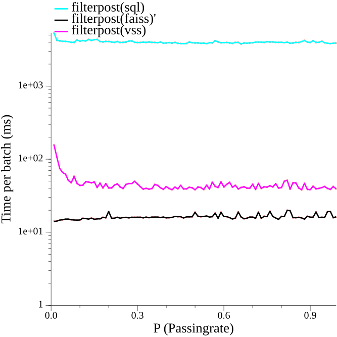

# Getting started

## Installing the extension
This extension can be installed form the community repository:
```sql
INSTALL faiss FROM community;
```

From then on you can load the extension using sql:
```sql
load faiss;
```

If at any point you update duckdb, you have to install the extension again.

This extension can also be compiled yourself, see [Building the extension](#Building-the-extension).

### MacOS

If you are on MacOS, you will need to install OpenMP runtime libraries. This can be done via brew:

```
brew install libomp
```

## Running the extension
To run the extension code, simply start the shell with `build/release/duckdb`.

Now we can use the features from the extension directly in DuckDB. For example, we can execute a faiss index using the following:
```
D CALL faiss_create('flat8', 8, 'Flat');
┌─────────┐
│ Success │
│ boolean │
├─────────┤
│ 0 rows  │
└─────────┘
```

### Possible values for index type

The index type is passed directly into `index_factory`.
Refer to the following wiki pages for the value of this parameter:

https://github.com/facebookresearch/faiss/wiki/The-index-factory

https://github.com/facebookresearch/faiss/wiki/Faiss-indexes

## Example

Here is one example, using random data (not a good idea in high dimensions btw). You can play with the dimensionality, number of datapoints, number of queries, and the faiss index type.
If you want to modify add parameters as well, check out how to use the `_param` variants below. 

```sql
-- Generate semi-random input data and queries
-- Note that the dimensionality of our data will be 5
CREATE TABLE input AS SELECT i as id, apply(generate_series(1, 5), j-> CAST(hash(i*1000+j) AS FLOAT)/18446744073709551615) as data FROM generate_series(1, 1000) s(i);
CREATE TABLE queries AS SELECT i as id, apply(generate_series(1, 5), j-> CAST(hash(i*1000+j+8047329823) AS FLOAT)/18446744073709551615) as data FROM generate_series(1, 10) s(i);
-- Create the index
CALL FAISS_CREATE('name', 5, 'IDMap,HNSW32');
-- Optionally, we can manually train the index. Possible using a subset of the data.
-- CALL FAISS_MANUAL_TRAIN((SELECT data FROM input), 'name');
-- Insert the data into the index
CALL FAISS_ADD((SELECT id, data FROM input), 'name');
-- Get 10 results with uneven id
SELECT id, UNNEST(FAISS_SEARCH_FILTER('name', 10, data, 'id%2==0', 'rowid', 'input')) FROM queries;
-- Get 10 results with even id
SELECT id, UNNEST(FAISS_SEARCH_FILTER('name', 10, data, 'id%2==0', 'rowid', 'input')) FROM queries;
-- Get 10 results
SELECT id, UNNEST(FAISS_SEARCH('name', 10, data)) FROM queries;
```

# Benchmarks

The initial thesis this was written for, can be found [here](https://www.cs.ru.nl/bachelors-theses/2024/Jaap_Aarts___1056714___Implementing_in-Database_Similarity_Search.pdf). The thesis evaluates benchmarks of all 3 methods implemented in this extension, for 3 different indexes (HNSW and 2 variants of IFV, on page 26-28). The report also presents a comparison against DuckDB's VSS extension, however the comparison is outdated and only includes a small amount of data due to previous limitations of VSS. The methodology section introduces the setup and details of these benchmarks.

Additional (newer) experiments have compared VSS directly against FAISS, using the methodology introduced in the thesis above. Here is the graph of VSS vs FAISS vs SQL:



The VSS extension only supports a query batch size of 1; the number of results is computed based on the passingrate, setting up a binomial(P) CDF to 99.

Note that this is a Logarithmic scale, since otherwise the only thing you could see would be one SQL line and one VSS/FAISS line.
As you can see FAISS is significantly faster, even if we use only single-query batches. 

FAISS has been optimised heavily for batches with multiple queries. For example, searching for a batch of 48 queries is only 25% slower than a single query. (Results not shown here.)

# Functions

The FAISS extension provides several functions that can be used to interact with FAISS indexes. 

An overview of functions provided has been grouped into thee following categories: Creation/deletion, Addition, and, Search.

## Creation/Deletion

These functions manipulate indexes, without modifying the data.

### faiss\_create

```sql
CALL faiss_create(string name, int dimension, string index_type);
```

 - `name`: The name given to the index. Each database can only have a single index per name; and it will crash when you give it a name with an index already attached. These indexes are global, and can be refered to by their name for subsequent operations.
 - `dimension`: The dimensionality of the data.
 - `index_type`: The index type given to [the faiss index factory](https://github.com/facebookresearch/faiss/wiki/The-index-factory). 

### faiss\_create\_params

```sql
CALL faiss_create_params(string name, int dimension, string index_type, MAP<string, string> parameters);
```

 - `name`: The name given to the index. Each database can only have a single index per name; the function will crash when you give it a name with an index already attached. These indexes are global, and can be refered to by their name for subsequent operations.
 - `dimension`: The dimensionality of the data.
 - `index_type`: The index type given to [the faiss index factory](https://github.com/facebookresearch/faiss/wiki/The-index-factory). 
 - `parameters`: The parameters of the index. For example passing `{'efConstruction': '1000'}` when creating an `HNSW` index, will set the efConstruction field to 1000. This is recursive, for example, when using an `IVF` with `HNSW`, `ivf.efConstruction` can be used to set the `efConstruction` value on the `HNSW` index. Note that currently, the implementation is verry limmited. Recursion is only implemented for `IDMap`, and only `efConstruction` is implemented for HNSW. No other parameters have been implemented yet, but these should be easy to add.

Both `faiss_create` and `faiss_create_param` support the named parameter `metric_type` to specify how to calculate the distance between vectors.

The following metric types are currently supported:
- "INNER_PRODUCT": `faiss::METRIC_INNER_PRODUCT`
- "L2": `faiss::METRIC_L2`
- "L1": `faiss::METRIC_L1`
- "Linf": `faiss::METRIC_Linf`
- "Lp": `faiss::METRIC_Lp`
- "Canberra": `faiss::METRIC_Canberra`
- "BrayCurtis": `faiss::METRIC_BrayCurtis`
- "JensenShannon": `faiss::METRIC_JensenShannon`
- "Jaccard": `faiss::METRIC_Jaccard`

### faiss\_save

```sql
CALL faiss_save(string name, string path);
```

 - `name`: The name of the index to be saves.
 - `path`: The target path to be saved to.

Note that saving/loading an index may remove the ability to add data to it or to train it. Only untrained indexes are mutable. (This is the case, because after the index is trained, we no longer know the training data.) This restriction might be eliminated in the future, when using the manual train function.


### faiss\_load

```sql
CALL faiss_load(string name, string path);
```

 - `name`: The name given to the loaded index.
 - `path`: The location of the index to be read.

Note that saving/loading an index may remove the ability to add data to it or to train it. Only untrained indexes are mutable. (This is the case, because after the index is trained, we no longer know the training data.) This restriction might be eliminated in the future, when using the manual train function.

### faiss\_destroy

```sql
CALL faiss_destroy(string name, string path);
```

 - `name`: The name of the index to be destroyed

## Moveing to GPU

### faiss\_move\_gpu

```sql
CALL faiss_move_gpu(string name, int gpu_index);
```

 - `name`: The name given to the loaded index.
 - `gpu_index`: The index of the gpu the faiss index to.


## Training and Adding

### faiss\_add

```sql
CALL faiss_add(TABLE data, string name);
```

 - `data`: A table with one or 2 columns. If there is only one column, this is the data column, and ids are creatd by faiss if possible. If there are 2 columns, the first is the id column of an integer type, and the second column is the data column. The data column most be a list of length equal to the index dimension
 - `name`: The name of the index that should be added to.

`faiss_add` retrains the index and keeps a copy of all the data for later retraining, unless previously trained with `faiss_manual_train`. If retraining is not desired or memory is limited, use `faiss_manual_train` for more control over training.

### faiss\_manual\_train

```sql
CALL faiss_manual_train(TABLE data, string name);
```

 - `data`: A table with a single column. The type of this column must be a list of length equal to the index dimension.
 - `name`: The name of the index that should be added to.

`faiss_manual_train` trains the index manually, and flags it as having been. Subsequent calls to `faiss_add` will not further train the index, and do not store copies of the data; saving on retraining when adding new data later, and reducing the memory requirements for indexes over larger datasets.

## Searching and filtering

### faiss\_search

```sql
CALL faiss_search(string name, integer k, List q);
```

 - `name`: The name of the index that should be added to.
 - `k`: The amount of results to be returned.
 - `q`: The query vector for which the nearest neighbors should be computer.

And, a variant with parameters:

```sql
CALL faiss_search(string name, integer k, List q, MAP<string, string> parameters);
```

 - `parameters`: The parameters for searching the index. For example passing `{'efSearch': '1000'}` when searching`HNSW` index, will set the efSearch field to 1000. This is recursive, for example, when using an `IVF` with `HNSW`, `ivf.efSearch` can be used to set the `efSearch` value for the `HNSW` index. Note that currently, the implementation is limited. Recursion is only implemented for `IDMap` and `IVF`, and a few fields have been implemented only. Extending the coverage of additional FAISS options should be easy.

`faiss_search` returns a list of structs with 3 fields: `rank` (of type `INTEGER`), `label` (of type `BIGINT`), and `distance` (of type `DISTANCE`). The length of this list is fixed at `k`, even if an insufficient number of results is found - when the `label` field would correspond to `-1`.

### faiss\_search\_filter

```sql
CALL faiss_search_filter(string name, integer k, List q, string filter, string idselector, string tablename);
```

 - `name`: The name of the index that should be added to.
 - `k`: The amount of results to be returned.
 - `q`: The query vector for which the nearest neighbors should be computer.
 - `filter`: Expression to be used to select which rows are selected for search. If this expresion results in a 1 for a certain row, the result of `idselector` will be included in the search.
 - `idselector`: Expression to be used to select the id of the row.
 - `tablename`: The name of the table on which filter and idselector are executed.

And a variant with parameters:

```sql
CALL faiss_search_filter(string name, integer k, List q, MAP<string, string> parameters);
```

 - `parameters`: The parameters for searching the index. For example passing `{'efSearch': '1000'}` when searching`HNSW` index, will set the efSearch field to 1000. This is recursive, for example, when using an `IVF` with `HNSW`, `ivf.efSearch` can be used to set the `efSearch` value for the `HNSW` index. Note that currently, the coverage of FAISS options in the implementation is limited. Recursion is only implemented for `IDMap` and `IVF`, and only a few fields are supported. (Easy to add new options.)

`faiss_search_filter` returns a list of structs with 3 fields: `rank` of type `INTEGER`, `label` of type `BIGINT`, and `distance` of type `DISTANCE`. The length of this list is fixed at `k`, even if an insufficient number of results is found - when the `label` field would correspond to `-1`.

For context, the filter executes (approximately) the following query: `SELECT {idselector} FROM {tablename} WHERE {filter}=1`. Only IDs for which the filter evaluates to `1` are included in the search results. The number of rows in `table` is assumed to be equal to the amount of vectors, or the extension might crash. Internally, this function creates a bitmap of size `n` where `n` is the size of the table, this operation is `O(n)`. To improve performance, make sure that the ids are incremental, in order, and start at a multiple of 64. This greatly helps the performance of creating the bitmap.


### faiss\_search\_filter\_set

```sql
CALL faiss_search_filter\_set(string name, integer k, List q, string filter, string idselector, string tablename);
```

 - `name`: The name of the index that should be added to.
 - `k`: The amount of results to be returned.
 - `q`: The query vector for which the nearest neighbors should be computer.
 - `filter`: Expression to be used to select which rows are selected for search. If this expresion results in a 1 for a certain row, the result of `idselector` will be included in the search.
 - `idselector`: Expression to be used to select the id of the row.
 - `tablename`: The name of the table on which filter and idselector are executed.

And a variant with parameters:

```sql
CALL faiss_search_filter_set(string name, integer k, List q, MAP<string, string> parameters);
```

 - `parameters`: The parameters for searching the index. For example passing `{'efSearch': '1000'}` when searching`HNSW` index, will set the efSearch field to 1000. This is recursive, for example, when using an `IVF` with `HNSW`, `ivf.efSearch` can be used to set the `efSearch` value for the `HNSW` index. Note that currently, the implementation is limited. Recursion is only implemented for `IDMap` and `IVF`, and a few fields are implemented only. (Other FAISS options would be easy to add.)

`faiss_search_filter_set` returns a list of structs with 3 fields: `rank` of type `INTEGER`, `label` of type `BIGINT`, and `distance` of type `DISTANCE`. The length of this list is always `k`, even if an insufficient number of results is found; superfluous items have a `label` field equal to `-1`.

For context, currently the way this filter is constructed, is by executing approximately this query: `SELECT {idselector} FROM {tablename} WHERE {filter}=1`. Only IDs for which the filter evaluates to `1` will be included in the search results. The amount of rows in `table` is assumed to be equal to the amount of vectors. If this is not the case, the extension might crash. This function creates a set of size `m` where `m` is the amount of vectors that are included in the search, this operation is `O(m)`.

# Custom Builds

## Checkout the repository

Clone the repository and check out the git submodules:
```sh
git clone --recurse-submodules https://github.com/arjenpdevries/faiss.git
```
Usung `--recurse-submodules` ensures to clone the right versions of DuckDB and FAISS for the extension.

## Building the extension

Building the extension depends upon the [`vcpkg` fork here](https://github.com/jaicewizard/vcpkg) at branch `fix_openblas_macos`, using a recent version of the vcpkg tools and setting `VCPKG_ROOT={path to vcpkg fork}`. 

Alternatively, remove the `openmp` feature for from the `openblas` specification in `vcpkg.json`.

To build the extension:
```sh
make release
```
The main binaries to build are:
```sh
./build/release/duckdb
./build/release/test/unittest
./build/release/extension/faiss/faiss.duckdb_extension
```

Here:
- `duckdb` is the binary for the duckdb shell with the extension code automatically loaded. 
- `unittest` is the test runner of duckdb. Again, the extension is already linked into the binary.
- `faiss.duckdb_extension` is the loadable binary as it would be distributed.

### Building with CUDA

CUDA is enabled by default on linux platforms, however, when you do not wish to compile with cuda, simply pass `FAISS_EXT_NO_GPU=TRUE` to make when compiling like so: `make release -j FAISS_EXT_NO_GPU=TRUE`. This will disable compiling for CUDA, allowing builds on systems without CUDA.

## Running the tests

Sql test:
```sh
make test
```

## Running conformance/accuracy tests

For now, the accuracy tests are separated from the normal tests, since they require a large download.

To run the index index accuracy tests run:

```
make run_msmarco_queries
```

# TODO list

Ideas that could still be implemented

 - [ ] Use array of fixed size instead of lists as input for greater type-safety
 - [ ] Check types of input, again for greater type-safety
